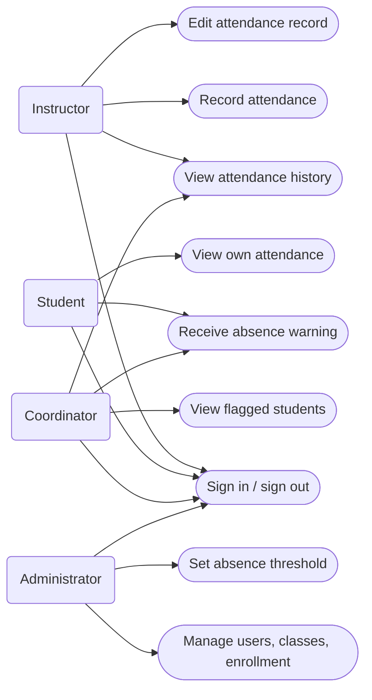
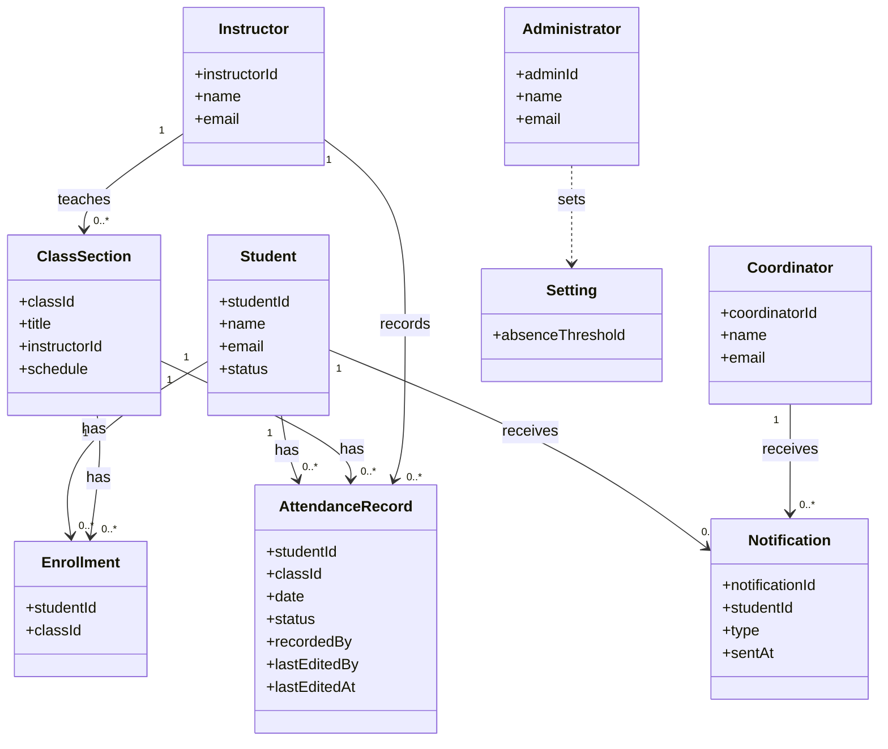
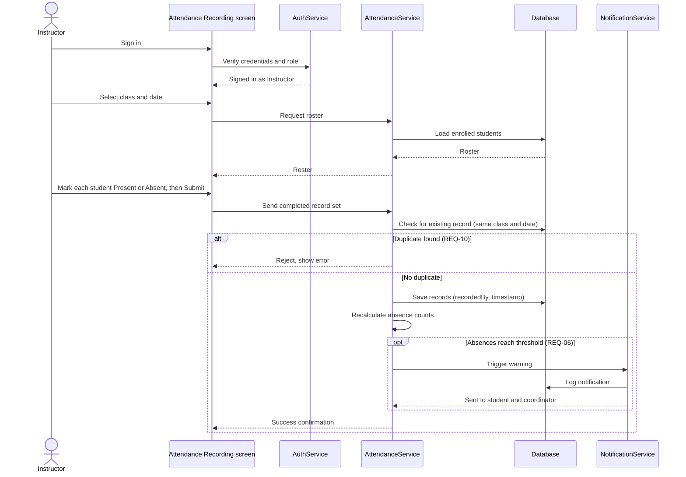

# UML Diagrams — Student Attendance Monitoring System (SAMS)

**Group:** BSIT 3A · **Members:** Angela Rose R. Gramatica, Honey Lee Sibugan

These diagrams are written in Mermaid, so GitHub draws them automatically when you open this file.

## 1. Use Case Diagram

Who uses the system and what they can do. (Mermaid has no built-in use case diagram, so this uses a flowchart: rounded boxes are users, ovals are use cases.)

## 2. Class Diagram

The main classes, their key fields, and how they relate. Matches §2.2 and §5 of the design specification.

## 3. Sequence Diagram — Recording Attendance

The same workflow as §4 of the design specification.

